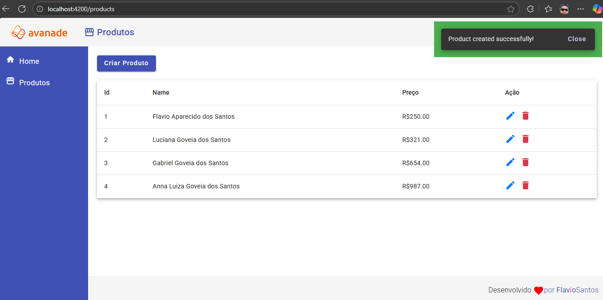

## 📋 Sobre o Projeto

Este projeto frontend foi desenvolvido com **Angular 19**, seguindo boas práticas de organização, componentização e estrutura modular. O principal objetivo é estudar e aprofundar conhecimentos em Angular, com foco na integração com APIs REST e no consumo de dados dinâmicos em aplicações reais.

---

## 🚀 Tecnologias Utilizadas

- [Angular 19](https://angular.io/)
- TypeScript ~5.7
- RxJS ~7.8
- Angular Material 19.2
- SCSS/CSS
- HTML 5

---

## 📁 Estrutura do Projeto

```bash
src/
│
├── app/
│   ├── services/        # Serviços para API
│   ├── components/      # Componentes reutilizáveis
│   └── pages/           # Páginas principais
├── assets/              # Imagens, ícones, etc.
└── environments/        # Configurações por ambiente (dev/prod)
```

## Tela Principal - /Home


---

## ⚖️ Como Rodar o Projeto

### 1. Instale as dependências:

```bash
npm install
```

### 2. Execute o projeto em modo de desenvolvimento:

```bash
npm start
```

Ou diretamente:

```bash
ng serve
```

### 3. Acesse no navegador:

```
http://localhost:4200
```

---

## ⚙️ Configuração de Ambiente

O Angular utiliza arquivos de configuração de ambiente ao invés de `.env`. O valor da URL da API, por exemplo, é configurado no arquivo:

```
src/environments/environment.ts
```

Exemplo:

```ts
export const environment = {
  production: false,
  apiUrl: 'https://backend-json-server.onrender.com'
};
```

---

## 🛡️ Erros Comuns

### `404 Not Found` com URL `undefined`

Esse erro geralmente ocorre quando a variável `environment.apiUrl` **não foi corretamente importada** ou está vazia.

✅ Solução: verifique se está usando a importação correta no seu serviço:

```ts
import { environment } from 'src/environments/environment';
```

---

